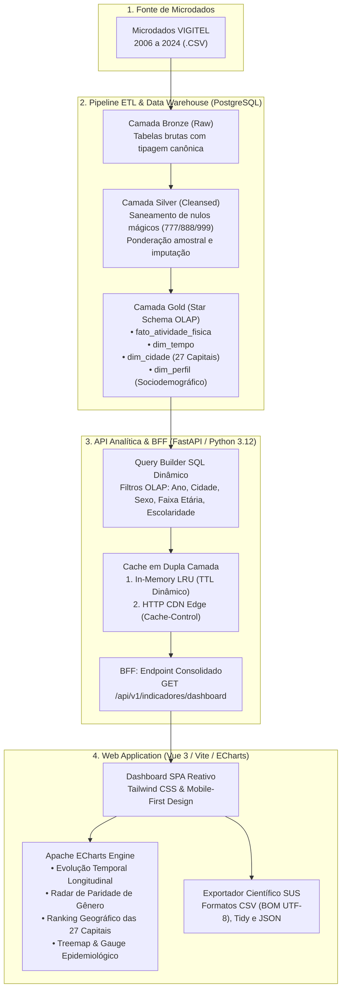
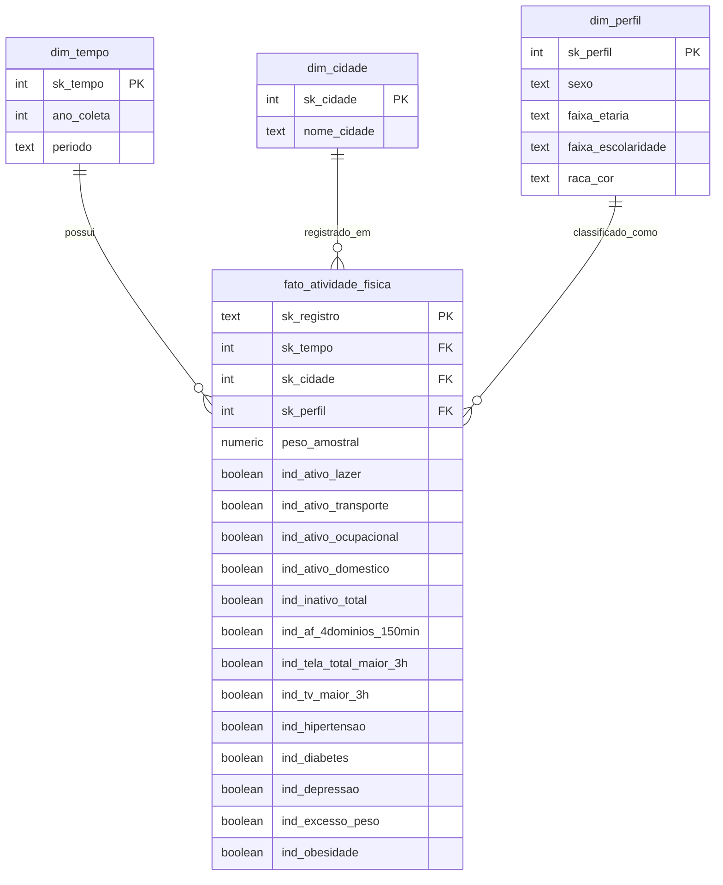
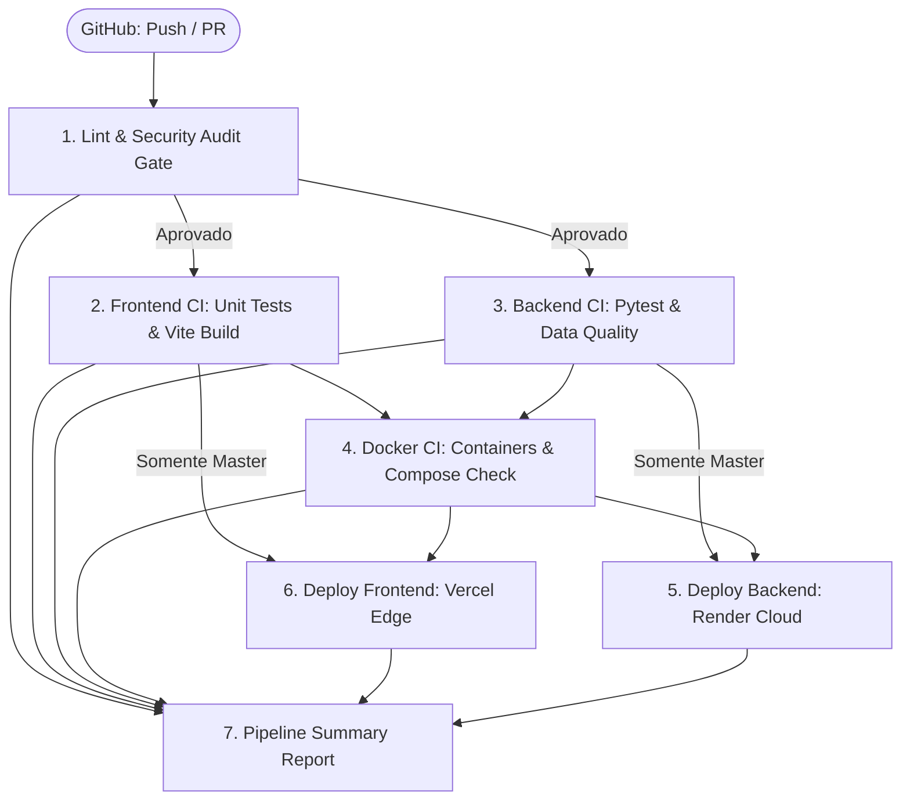

# 📊 VIGITEL Analytics Dashboard

> **Trabalho de Conclusão de Curso (TCC)**  
> **Plataforma Analítica e Interativa de Vigilância Epidemiológica de Fatores de Risco e Proteção para Doenças Crônicas por Inquérito Telefônico (VIGITEL)**

[](https://github.com/KevenGustavo/vigitel-dashboard/actions/workflows/ci-cd.yml)
[](https://fastapi.tiangolo.com)
[](https://vuejs.org/)
[](https://www.postgresql.org/)
[](https://www.docker.com/)
[](LICENSE)

---

## 📌 1. Visão Geral e Contexto Acadêmico

O **VIGITEL Analytics Dashboard** é uma solução computacional completa de Engenharia de Dados, Ciência de Dados e Visualização Interativa desenvolvida como Trabalho de Conclusão de Curso. A aplicação analisa e democratiza o acesso aos microdados públicos do sistema **VIGITEL (Vigilância de Fatores de Risco e Proteção para Doenças Crônicas por Inquérito Telefônico)**, gerido pela Secretaria de Vigilância em Saúde e Ambiente do **Ministério da Saúde do Brasil**.

### 🎯 Objetivos Centrais
- **Engenharia de Dados Robusta**: Estruturar e sanear um histórico longitudinal de quase duas décadas (2006 a 2024) de entrevistas nas 26 capitais dos estados brasileiros e no Distrito Federal (27 cidades).
- **Arquitetura Medalhão (Lakehouse/DW)**: Implementar pipeline de processamento em 3 camadas (*Bronze, Silver e Gold*) com modelagem dimensional em esquema estrela (*Star Schema*).
- **Backend-for-Frontend (BFF) & Edge Caching**: Oferecer API analítica de alta performance em FastAPI com agregação consolidada e política de cache HTTP na borda da CDN (5 a 15ms de latência).
- **Interface Analítica Moderna**: Dashboard intuitivo em Vue 3, Tailwind CSS e Apache ECharts, totalmente responsivo, com métricas epidemiológicas padronizadas pela Organização Mundial da Saúde (OMS).
- **DevOps & Automação**: Pipeline de CI/CD estruturada em grafo acíclico dirigido (DAG) no GitHub Actions com auditoria de segurança, 83 testes automatizados e implantação contínua na nuvem.

---

## 🏗️ 2. Mapeamento da Arquitetura do Sistema

A arquitetura do ecossistema integra engenharia de dados, microsserviços analíticos, visualização web reativa e esteira de entrega contínua.



---

## 🏛️ 3. Modelagem Dimensional (Star Schema — Camada Gold)

Para viabilizar consultas analíticas complexas com agregações em sub-segundos sobre milhões de registros ponderados, a camada **Gold** adota a metodologia de modelagem dimensional de Ralph Kimball:



---

## ⚡ 4. Principais Componentes Funcionais do Dashboard

O dashboard foi estruturado em módulos epidemiológicos baseados nos guias de saúde populacional:

| Módulo | Indicadores Epidemiológicos Analisados | Representação Visual |
| :--- | :--- | :--- |
| **Visão Geral** | Score Sintético VIGITEL (0 a 100), KPIs macro ponderados e cartões de tendência histórica. | Gauge de Saúde Populacional, KPIs com deltas de evolução e breakdown ponderado. |
| **Atividade Física** | Prática de atividade física no lazer, deslocamento ativo, atividade ocupacional e cumprimento da meta global da OMS (≥ 150 min/semana). | Gráfico de linhas temporal interativo com teto dinâmico adaptativo. |
| **Sedentarismo** | Tempo de tela excessivo (> 3 horas diárias), hábito televisivo prolongado e sedentarismo por transição geracional. | Gráfico de barras horizontais por faixa etária e séries temporais com preenchimento em gradiente. |
| **Desfechos de Saúde** | Prevalência autorreferida de Obesidade, Excesso de Peso (IMC calculado), Hipertensão Arterial, Diabetes Mellitus e Depressão. | Treemap de morbidades crônicas e Radar de Paridade de Gênero (Masculino vs. Feminino). |
| **Ranking Geográfico** | Análise comparativa da prevalência dos agravos em todas as 27 capitais brasileiras. | Bar chart horizontal ordenado com destaque para as capitais com maior e menor prevalência. |
| **Exportador SUS** | Extração de recortes epidemiológicos filtrados pelo usuário. | Exportação em 1 clique: CSV formatado SUS (com BOM UTF-8), CSV Tidy (para R/Python) e JSON estruturado. |

---

## 🛠️ 5. Stack Tecnológica

| Camada | Tecnologia | Justificativa Arquitetural |
| :--- | :--- | :--- |
| **Banco de Dados** | **PostgreSQL 18** | Banco relacional robusto com suporte nativo a schemas para Arquitetura Medalhão e índices analíticos B-Tree. |
| **Backend & API** | **Python 3.12 / FastAPI** | Execução assíncrona (`asyncio` / `asyncpg`), tipagem estrita com Pydantic v2 e documentação OpenAPI interativa. |
| **Frontend** | **Vue.js 3 (Composition API)** | Reatividade granular, componentização modular, excelente performance em dispositivos móveis e desktop. |
| **Estilização** | **Tailwind CSS v4** | Design system utilitário com suporte a tema escuro profundo (*slate/emerald*), responsividade fluida e zero overhead de runtime. |
| **Data Viz** | **Apache ECharts / vue-echarts** | Renderização gráfica via Canvas/SVG com alta taxa de quadros (60 fps), tooltips ricos e transições fluidas. |
| **Empacotador** | **Vite v8** | Compilação ultrarrápida (HMR instantâneo em desenvolvimento e build de produção otimizado). |
| **DevOps & CI/CD** | **GitHub Actions** | Orquestração de pipeline em grafo acíclico dirigido (DAG), gates de qualidade, linters e deploy contínuo. |
| **Deploy & Cloud** | **Render (API) & Vercel (Web)** | Hospedagem serverless com distribuição global em Edge CDN e escalabilidade sob demanda. |

---

## 🚀 6. Pipeline de Integração e Entrega Contínua (CI/CD)

A esteira de automação segue o padrão **DAG (Directed Acyclic Graph)**, garantindo fail-fast na validação de código e proteção estrita de implantação:



- **Gatekeeper Inicial**: Ruff (linter Python) e auditorias de dependências (`pip-audit`, `npm audit`).
- **Testes Automatizados (83 testes)**:
  - **43 testes de Backend & ETL** (`pytest`): testam conexões, esquemas, integridade referencial e endpoints.
  - **40 testes de Frontend** (`node:test`): validam sanitização contra XSS, cálculos epidemiológicos, paginação e serialização de filtros.
- **Continuous Deployment**: Disparado automaticamente na branch `master` após 100% de aprovação nos testes e compilação dos containers Docker.

---

## 💻 7. Como Executar o Projeto Localmente

### Pré-requisitos
- [Git](https://git-scm.com/)
- [Docker](https://www.docker.com/) e [Docker Compose](https://docs.docker.com/compose/)
- [Python 3.12+](https://www.python.org/) e [Node.js 24+ (LTS)](https://nodejs.org/) com [PostgreSQL 18+](https://www.postgresql.org/)

---

### Opção A: Execução Completa via Docker Compose (Recomendado)

1. Clone o repositório:
   ```bash
   git clone https://github.com/KevenGustavo/vigitel-dashboard.git
   cd vigitel-dashboard
   ```

2. Configure o arquivo de variáveis de ambiente:
   ```bash
   cp .env.example .env
   ```

3. Suba todo o ambiente (PostgreSQL, Backend FastAPI e Frontend Nginx):
   ```bash
   docker compose up --build -d
   ```

4. Acesse as aplicações:
   - **Frontend Dashboard**: [http://localhost:3000](http://localhost:3000)
   - **API FastAPI & Swagger**: [http://localhost:8080/docs](http://localhost:8080/docs)
   - **Health Check da API**: [http://localhost:8080/health](http://localhost:8080/health)

---

### Opção B: Execução Manual para Desenvolvimento

#### 1. Banco de Dados e Backend (Python)
```bash
# Crie e ative o ambiente virtual
uv venv .venv
source .venv/bin/activate  # No Windows: .venv\Scripts\activate

# Instale as dependências
uv pip install -r requirements.txt

# Configure seu .env local a partir do exemplo
cp .env.example .env

# Execute a API em modo reload
uvicorn src.api.main:app --host 0.0.0.0 --port 8080 --reload
```

#### 2. Frontend (Node.js / Vue 3)
```bash
cd src/web

# Instale as dependências
npm install

# Inicie o servidor de desenvolvimento Vite
npm run dev
```
O frontend estará acessível em `http://localhost:5173`.

---

## 🧪 8. Execução da Suíte de Testes

Para garantir a confiabilidade acadêmica e de engenharia do software, execute os testes automatizados:

```bash
# 1. Testes de Backend & Qualidade de Dados (Pytest)
pytest tests/ -v

# 2. Verificação de Linting e Formatação (Ruff)
ruff check src/ tests/

# 3. Testes Unitários de Frontend & Cobertura Nativa Node 24 (Node Test Runner)
cd src/web
npm test
npm run test:coverage

# 4. Compilação de Produção do Frontend (ES2022)
npm run build
```

---

## 📂 9. Estrutura de Diretórios do Repositório

```text
vigitel-dashboard/
├── .github/
│   ├── workflows/
│   │   └── ci-cd.yml          # Esteira completa CI/CD em formato DAG
│   └── SECRETS_GUIDE.md       # Guia de configuração de credenciais no GitHub
├── data/
│   └── raw/                   # Microdados brutos do VIGITEL (CSV / Excel)
├── sql/
│   ├── init.sql               # Inicialização de schemas PostgreSQL
│   └── ci_test_schema.sql     # Seed hermético e isolado para testes no CI
├── src/
│   ├── api/                   # Aplicação Backend FastAPI
│   │   ├── db/                # Engine assíncrona, pools e modelos de metadados
│   │   ├── routes/            # Endpoints analíticos e endpoint consolidado (BFF)
│   │   ├── schemas/           # Contratos de dados Pydantic v2
│   │   └── services/          # Camada de negócios, Query Builder e TTL Caching
│   ├── core/                  # Configurações globais e resolução de URLs de banco
│   ├── etl/                   # Pipelines de Engenharia de Dados (Bronze, Silver, Gold)
│   │   ├── jobs/              # Scripts de ingestão, transformação e carga dimensional
│   │   └── schema.py          # Dicionário de variáveis e contratos do VIGITEL
│   └── web/                   # Aplicação Frontend Vue 3 (Vite + Tailwind CSS)
│       ├── src/
│       │   ├── features/      # Componentes organizados por domínio epidemiológico
│       │   ├── plugins/       # Registros de plugins e Apache ECharts
│       │   └── utils/         # Algoritmos de cálculo, formatação e sanitização
│       └── tests/             # Testes analíticos unitários do Frontend
├── tests/
│   ├── api/                   # Testes de integração de rotas, cache e query builder
│   └── etl/                   # Testes de volumetria, schemas e integridade referencial
├── docker-compose.yml         # Orquestração local dos containers do ecossistema
├── Dockerfile                 # Multi-stage Dockerfile da API Python
├── pyproject.toml             # Configurações de ferramentas (pytest, ruff)
├── requirements.txt           # Dependências Python de produção
└── render.yaml                # Especificação de Infrastructure as Code (Render)
```

---

## 📜 10. Licença e Considerações Éticas

Este projeto é disponibilizado sob a licença **MIT**.  
Os microdados utilizados são de domínio público, fornecidos pelo **Ministério da Saúde do Brasil**, em conformidade com as diretrizes da Lei Geral de Proteção de Dados (LGPD — Lei nº 13.709/2018), preservando o anonimato estrito dos entrevistados.

---

<p align="center">
  <b>Desenvolvido como Trabalho de Conclusão de Curso (TCC) para Engenharia da Computação.</b><br/>
  <i>Engenharia de Dados • Engenharia de Software •  Ciência de Dados • Vigilância em Saúde Pública</i>
</p>
